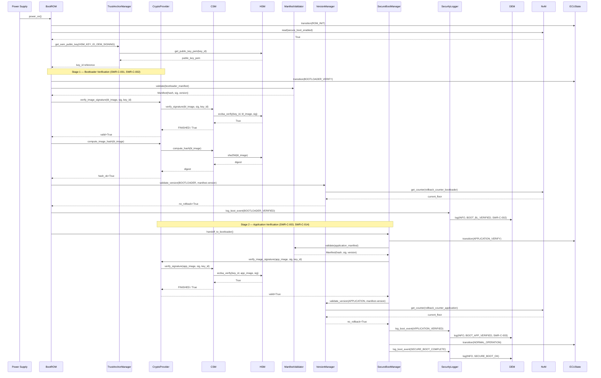
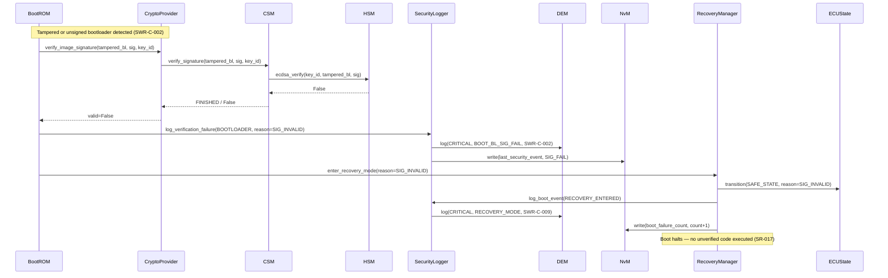
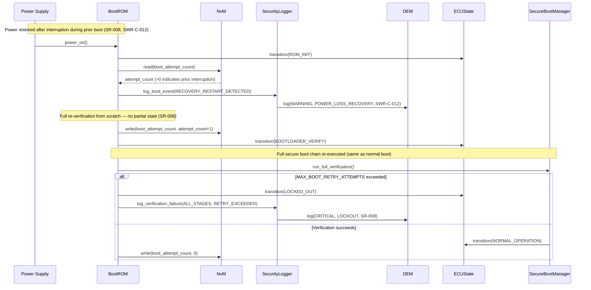
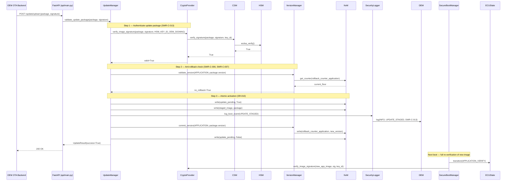

# Dynamic Architecture — SecureBootLab

**Document ID:** SB-DA-001
**Version:** 0.1
**Date:** 2026-06-09
**ASPICE Process:** SWE.2

| Version | Date | Author | Change |
|---|---|---|---|
| 0.1 | 2026-06-09 | [Author TBD] | Initial release |

---

## 1. Primary Happy-Path: Normal Secure Boot Sequence

---

## 2. Failure / Abort Flow — Signature Verification Failure

---

## 3. Recovery Flow — Power Loss During Verification

---

## 4. OTA Update Authentication Flow

