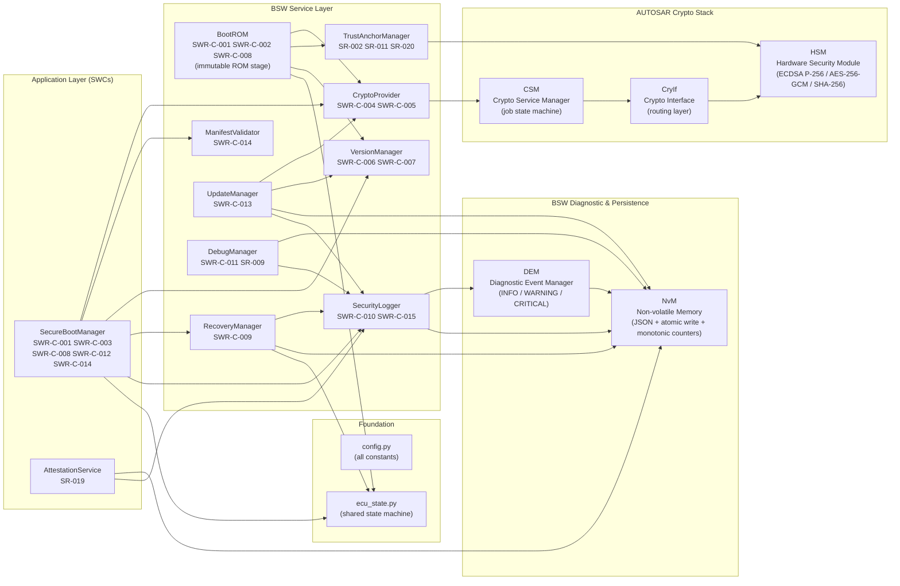
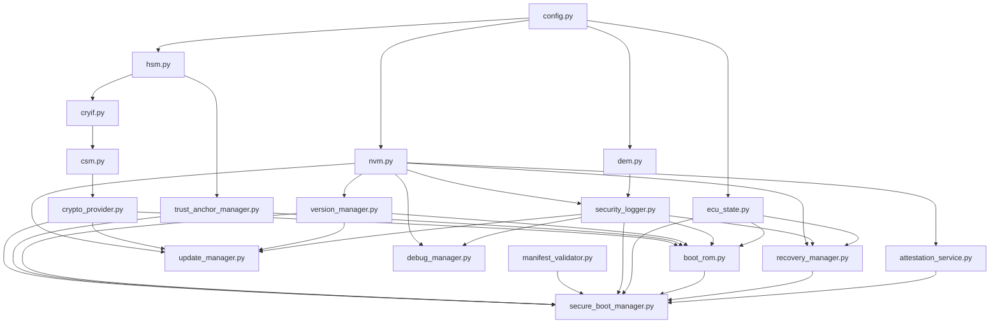

# Static Architecture — SecureBootLab

**Document ID:** SB-SA-001
**Version:** 0.1
**Date:** 2026-06-09
**ASPICE Process:** SWE.2

| Version | Date | Author | Change |
|---|---|---|---|
| 0.1 | 2026-06-09 | [Author TBD] | Initial release |

---

## 1. AUTOSAR Classic Layering Overview



---

## 2. Component Dependency Graph (Bottom-Up)



---

## 3. AUTOSAR Layer to Module Mapping

| Module | AUTOSAR Equivalent | SWR-C / SR | Layer |
|---|---|---|---|
| `boot_rom.py` | SecureBoot CDD (ROM stage) | SWR-C-001, SWR-C-002, SWR-C-008 | BSW / CDD |
| `secure_boot_manager.py` | SecureBoot SWC | SWR-C-001, SWR-C-003, SWR-C-008, SWR-C-012, SWR-C-014 | Application |
| `crypto_provider.py` | CSM Job Interface | SWR-C-004, SWR-C-005 | BSW Services |
| `trust_anchor_manager.py` | KeyM / CertMgr | SR-002, SR-011, SR-020 | BSW Services |
| `version_manager.py` | Anti-Rollback Counter | SWR-C-006, SWR-C-007 | BSW Services |
| `manifest_validator.py` | SWC Image Meta Parser | SWR-C-014 | BSW Services |
| `recovery_manager.py` | Bootloader Recovery SWC | SWR-C-009 | Application |
| `update_manager.py` | FBL UpdateActivation | SWR-C-013 | Application |
| `security_logger.py` | DEM + HashChainedLog | SWR-C-010, SWR-C-015 | BSW Services |
| `debug_manager.py` | Debug Authentication SWC | SWR-C-011, SR-009 | BSW Services |
| `attestation_service.py` | Measured Boot Reporter | SR-019 | Application |
| `csm.py` | CSM | *(shared)* | AUTOSAR Crypto Stack |
| `cryif.py` | CryIf | *(shared)* | AUTOSAR Crypto Stack |
| `hsm.py` | CryptoDriver / HSM CDD | *(shared)* | MCAL / CDD |
| `dem.py` | DEM | *(shared)* | BSW Services |
| `nvm.py` | NvM | *(shared)* | BSW Services |
| `ecu_state.py` | ECU State Manager | *(shared)* | BSW |
| `config.py` | AUTOSAR Configuration | *(shared)* | BSW Foundation |

---

## 4. Security Boundary Diagram

```
┌─────────────────────────────────────────────────────────────┐
│  HSM TRUST BOUNDARY (hsm.py)                                │
│  ┌─────────────────────────────────────────────────────┐    │
│  │  OEM Root Key   OEM Signing Key   Debug Auth Key    │    │
│  │  (ECDSA P-256 private keys — never exported)        │    │
│  └─────────────────────────────────────────────────────┘    │
└──────────────────────────┬──────────────────────────────────┘
                           │ public key PEM only
              ┌────────────▼────────────┐
              │  TrustAnchorManager     │  SR-002, SR-011, SR-020
              │  (public key registry)  │
              └────────────┬────────────┘
                           │ key_id only
              ┌────────────▼────────────┐
              │  CryptoProvider         │  SWR-C-004, SWR-C-005
              │  CryIf → CSM → HSM      │
              └────────────┬────────────┘
                           │ verify result (bool)
   ┌───────────────────────▼─────────────────────────────┐
   │  SecureBootManager / BootROM                         │
   │  SWR-C-001 SWR-C-002 SWR-C-003 SWR-C-008           │
   └───────────────────────┬─────────────────────────────┘
                           │ state transitions
              ┌────────────▼────────────┐
              │  ECUState               │
              │  BootPhase state machine│
              └─────────────────────────┘
```
