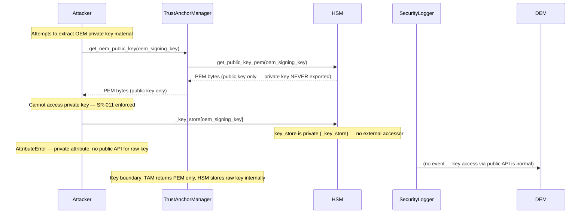

# Sequence Diagram — Trust Anchor and Certificate Chain Validation

**Document ID:** SB-SEQ-004 | **Version:** 0.1 | **Date:** 2026-06-09

Covers: VT-05, VT-10, VT-17, VT-21, VT-22 | Requirements: SR-002, SR-005, SR-011, SR-020

---

## Scenario A — Certificate Chain Validation (VT-21, SR-002, SR-020)

```mermaid
sequenceDiagram
    participant API as FastAPI
    participant TAM as TrustAnchorManager
    participant CP as CryptoProvider
    participant CSM as CSM
    participant HSM as HSM
    participant SL as SecurityLogger
    participant DEM as DEM

    Note over TAM: Certificate hierarchy: OEM Root CA → OEM Signing Cert → Firmware Signature
    API->>TAM: validate_certificate_chain(root_cert, signing_cert, fw_signature, fw_image)

    rect rgb(30, 60, 30)
        Note over TAM,HSM: Step 1 — Verify signing cert is signed by root CA (SR-002)
        TAM->>CP: verify_image_signature(signing_cert_body, signing_cert_sig, oem_root_key)
        CP->>CSM: verify_signature(signing_cert_body, signing_cert_sig, oem_root_key)
        CSM->>HSM: ecdsa_verify(oem_root_key, signing_cert_body, sig)
        HSM-->>CSM: True
        CSM-->>CP: True
        CP-->>TAM: chain_link_1=valid
    end

    rect rgb(30, 30, 60)
        Note over TAM,HSM: Step 2 — Verify firmware signature with signing cert key (SR-005)
        TAM->>CP: verify_image_signature(fw_image, fw_signature, oem_signing_key)
        CP->>CSM: verify_signature(fw_image, fw_signature, oem_signing_key)
        CSM->>HSM: ecdsa_verify(oem_signing_key, fw_image, fw_sig)
        HSM-->>CSM: True
        CSM-->>CP: True
        CP-->>TAM: chain_link_2=valid
    end

    TAM->>SL: log_boot_event(CERT_CHAIN_VALID)
    SL->>DEM: log(INFO, CERT_CHAIN_OK, SR-002)
    TAM-->>API: chain_valid=True

    alt Broken certificate chain
        TAM->>SL: log_verification_failure(CERT_CHAIN, CHAIN_BROKEN)
        SL->>DEM: log(CRITICAL, CERT_CHAIN_INVALID, SR-002)
        TAM-->>API: chain_valid=False
    end
```

---

## Scenario B — HSM Key Non-Exportability (VT-10, SR-011)

---

## Scenario C — Key Rotation with Authorization (SR-002, SR-020)

```mermaid
sequenceDiagram
    participant OEM as OEM Key Management
    participant TAM as TrustAnchorManager
    participant HSM as HSM
    participant SL as SecurityLogger
    participant DEM as DEM

    Note over OEM: Authorized key rotation — signed by current OEM root key
    OEM->>TAM: rotate_key(new_key_id=oem_signing_key_v2, authorization_sig)

    rect rgb(30, 60, 30)
        Note over TAM,HSM: Verify authorization signature with current root key (SR-002)
        TAM->>HSM: verify(oem_root_key, new_key_id.encode(), authorization_sig)
        HSM-->>TAM: True
    end

    TAM->>HSM: generate_key_pair(oem_signing_key_v2)
    HSM-->>TAM: key_id registered
    TAM->>SL: log_boot_event(KEY_ROTATED, {old:oem_signing_key, new:oem_signing_key_v2})
    SL->>DEM: log(INFO, KEY_ROTATION_COMPLETE, SR-002)
    TAM-->>OEM: rotation_success=True

    alt Unauthorized rotation attempt
        TAM->>HSM: verify(oem_root_key, new_key_id, bad_sig)
        HSM-->>TAM: False
        TAM->>SL: log_tamper_event(KEY_ROTATION_REJECTED, {attempt:unauthorized})
        SL->>DEM: log(CRITICAL, KEY_ROTATION_REJECTED, SR-002)
        TAM-->>OEM: TrustAnchorError("rotation_auth_failed")
    end
```

