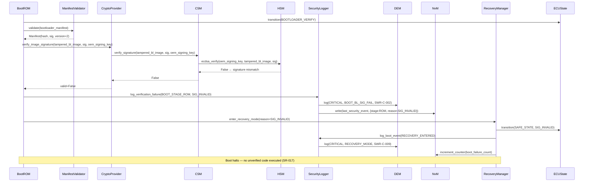
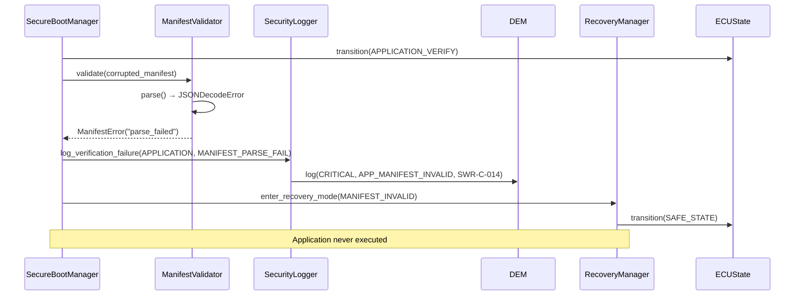
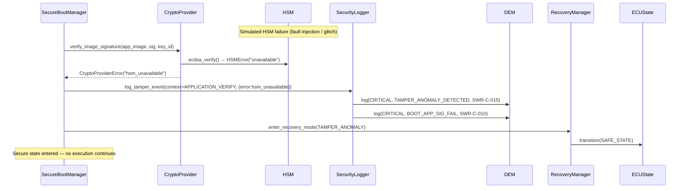

# Sequence Diagram — Failure and Abort Flow

**Document ID:** SB-SEQ-002 | **Version:** 0.1 | **Date:** 2026-06-09

Covers: VT-02, VT-04, VT-05, VT-08 | Requirements: SWR-C-002, SWR-C-009, SWR-C-010, SWR-C-014, SWR-C-015

---

## Scenario A — Tampered Bootloader Image (SWR-C-002)

---

## Scenario B — Invalid/Malformed Manifest (SWR-C-014)

---

## Scenario C — Tamper Event / Glitch Anomaly (SWR-C-015)

