# Sequence Diagram — Normal Secure Boot (Happy Path)

**Document ID:** SB-SEQ-001 | **Version:** 0.1 | **Date:** 2026-06-09

Covers: VT-01, VT-02, VT-14, VT-20 | Requirements: SWR-C-001, SWR-C-002, SWR-C-003, SWR-C-008

---

```mermaid
sequenceDiagram
    participant PWR as Power Supply
    participant BROM as BootROM
    participant TAM as TrustAnchorManager
    participant MV as ManifestValidator
    participant CP as CryptoProvider
    participant CSM as CSM
    participant HSM as HSM
    participant VM as VersionManager
    participant SBM as SecureBootManager
    participant ATT as AttestationService
    participant SL as SecurityLogger
    participant DEM as DEM
    participant NvM as NvM
    participant ECU as ECUState

    PWR->>BROM: power_on()
    BROM->>ECU: transition(ROM_INIT)
    BROM->>NvM: read(secure_boot_enabled) → True
    BROM->>NvM: read(boot_attempt_count) → 0

    rect rgb(30, 60, 30)
        Note over BROM,VM: ── Stage 1: Bootloader Verification (SWR-C-001, SWR-C-002) ──
        BROM->>ECU: transition(BOOTLOADER_VERIFY)
        BROM->>TAM: get_oem_public_key(oem_signing_key)
        TAM->>HSM: get_public_key_pem(oem_signing_key)
        HSM-->>TAM: PEM bytes
        TAM-->>BROM: key_id=oem_signing_key
        BROM->>MV: validate(bootloader_manifest)
        MV-->>BROM: Manifest(hash, sig, version=2, component=BOOTLOADER)
        BROM->>CP: verify_image_signature(bl_image, sig, oem_signing_key)
        CP->>CSM: verify_signature(bl_image, sig, oem_signing_key)
        CSM->>HSM: ecdsa_verify(oem_signing_key, bl_image, sig)
        HSM-->>CSM: True
        CSM-->>CP: True
        CP-->>BROM: True
        BROM->>CP: compute_image_hash(bl_image)
        CP->>CSM: compute_hash(bl_image)
        CSM->>HSM: sha256(bl_image)
        HSM-->>CSM: digest[32 bytes]
        CSM-->>CP: digest
        CP-->>BROM: digest == manifest.image_hash ✓
        BROM->>VM: validate_version(BOOTLOADER, 2)
        VM->>NvM: get_counter(rollback_counter_bootloader) → 1
        VM-->>BROM: 2 >= 1 → True
        BROM->>ATT: measure_component(BOOT_STAGE_BOOTLOADER, bl_image)
        ATT->>CSM: compute_hash(bl_image)
        CSM->>HSM: sha256(bl_image)
        HSM-->>ATT: digest
        ATT->>NvM: write(attestation_log.BOOTLOADER, digest)
        BROM->>SL: log_boot_event(BOOTLOADER_VERIFIED)
        SL->>DEM: log(INFO, BOOT_BL_VERIFIED, SWR-C-002)
    end

    rect rgb(30, 30, 60)
        Note over SBM,VM: ── Stage 2: Application Verification (SWR-C-003, SWR-C-008) ──
        BROM->>SBM: handoff_to_bootloader()
        SBM->>ECU: transition(APPLICATION_VERIFY)
        SBM->>MV: validate(application_manifest)
        MV-->>SBM: Manifest(hash, sig, version=3, component=APPLICATION)
        SBM->>CP: verify_image_signature(app_image, sig, oem_signing_key)
        CP->>CSM: verify_signature(app_image, sig, oem_signing_key)
        CSM->>HSM: ecdsa_verify(oem_signing_key, app_image, sig)
        HSM-->>CSM: True
        CSM-->>CP: True
        CP-->>SBM: True
        SBM->>CP: compute_image_hash(app_image)
        CP-->>SBM: digest == manifest.image_hash ✓
        SBM->>VM: validate_version(APPLICATION, 3)
        VM->>NvM: get_counter(rollback_counter_application) → 2
        VM-->>SBM: 3 >= 2 → True
        SBM->>ATT: measure_component(BOOT_STAGE_APPLICATION, app_image)
        ATT->>NvM: write(attestation_log.APPLICATION, digest)
        SBM->>SL: log_boot_event(APPLICATION_VERIFIED)
        SL->>DEM: log(INFO, BOOT_APP_VERIFIED, SWR-C-003)
    end

    SBM->>ECU: transition(NORMAL_OPERATION)
    SBM->>NvM: write(boot_attempt_count, 0)
    SBM->>SL: log_boot_event(SECURE_BOOT_COMPLETE)
    SL->>DEM: log(INFO, SECURE_BOOT_OK, SWR-C-008)
```

