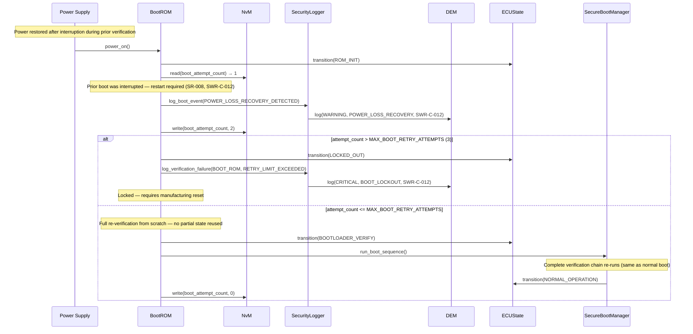

# Sequence Diagram — Recovery Flow

**Document ID:** SB-SEQ-003 | **Version:** 0.1 | **Date:** 2026-06-09

Covers: VT-07, VT-11 | Requirements: SWR-C-009, SWR-C-012, SR-008, SR-010, SR-017

---

## Scenario A — Power Loss Recovery / Boot Restart (SWR-C-012)

---

## Scenario B — Authenticated Recovery Flashing (SWR-C-009, SR-017)

```mermaid
sequenceDiagram
    participant OEM as OEM Recovery Tool
    participant RM as RecoveryManager
    participant CP as CryptoProvider
    participant CSM as CSM
    participant HSM as HSM
    participant VM as VersionManager
    participant NvM as NvM
    participant SL as SecurityLogger
    participant DEM as DEM
    participant ECU as ECUState

    Note over ECU: ECU is in SAFE_STATE after verification failure
    OEM->>RM: execute_recovery_flash(recovery_image, signature)

    rect rgb(30, 60, 30)
        Note over RM,CP: Step 1 — Authenticate recovery image (SR-017, SWR-C-009)
        RM->>CP: verify_image_signature(recovery_image, signature, oem_signing_key)
        CP->>CSM: verify_signature(recovery_image, signature, oem_signing_key)
        CSM->>HSM: ecdsa_verify(oem_signing_key, recovery_image, signature)
        HSM-->>CSM: True
        CSM-->>CP: True
        CP-->>RM: valid=True
    end

    rect rgb(30, 30, 60)
        Note over RM,NvM: Step 2 — Atomic flash activation (SR-010)
        RM->>NvM: write(update_pending, True)
        RM->>NvM: write(staged_image, recovery_image)
        RM->>VM: validate_version(APPLICATION, recovery_image.version)
        VM-->>RM: no_rollback=True
        RM->>VM: commit_version(APPLICATION, recovery_image.version)
        RM->>NvM: write(update_pending, False)
        RM->>SL: log_boot_event(RECOVERY_FLASH_COMPLETE)
        SL->>DEM: log(INFO, RECOVERY_COMPLETE, SWR-C-009)
        RM->>ECU: transition(SAFE_STATE)
        Note over RM: Reset required to boot new image
    end

    alt Recovery image unsigned or tampered
        RM->>SL: log_verification_failure(RECOVERY, SIG_INVALID)
        SL->>DEM: log(CRITICAL, RECOVERY_IMG_REJECTED, SWR-C-009)
        Note over RM: ECU remains in SAFE_STATE — unsigned image rejected (SR-017)
    end
```

