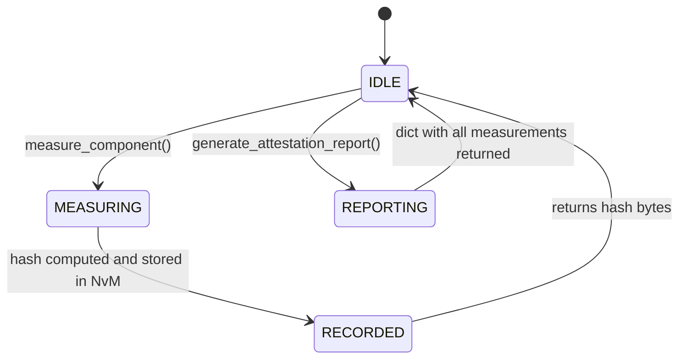

# LLD — AttestationService

**Document ID:** SB-LLD-011 | **Version:** 0.1 | **Date:** 2026-06-09 | **ASPICE:** SWE.3

| Version | Date | Author | Change |
|---|---|---|---|
| 0.1 | 2026-06-09 | [Author TBD] | Initial release |

---

## 1. Module Purpose

`attestation_service.py` implements measured boot by recording SHA-256 hashes of each boot
component (Boot ROM, Bootloader, Application) into a persistent log for backend fleet integrity
monitoring and remote attestation. Implements SR-019 (measured boot — record component hashes
for backend attestation reporting).

---

## 2. Public Interface

```python
class AttestationService:
    def measure_component(self, component_id: str, image_data: bytes) -> bytes
    def record_measurement(self, component_id: str, hash_bytes: bytes) -> None
    def generate_attestation_report(self) -> dict
    def get_measurements(self) -> dict[str, bytes]
```

---

## 3. Internal State Machine



---

## 4. Key Algorithms

1. **`measure_component(component_id, image_data)`**: Calls `CSM.compute_hash(image_data)` via the CSM job interface. Calls `record_measurement(component_id, digest)`. Returns the 32-byte digest.
2. **`record_measurement(component_id, hash_bytes)`**: Writes to `NvM(NVM_KEY_ATTESTATION_LOG)` as a dict keyed by `component_id`. Appends; does not overwrite prior measurements. Logs via `SecurityLogger.log_boot_event(MEASUREMENT_RECORDED)`.
3. **`generate_attestation_report()`**: Reads all recorded measurements from NvM. Returns a report dict: `{"timestamp": ..., "measurements": {"BOOT_ROM": hex, "BOOTLOADER": hex, "APPLICATION": hex}}`. In Phase 1, this is logged and returned to the API; actual backend transmission is deferred to Phase 2.

---

## 5. Data Structures

```python
_csm: CSM                                # injected; hash computation
_nvm: NvM                                # injected; measurement persistence
_sl: SecurityLogger                      # injected; event logging
_measurements: dict[str, bytes]          # in-memory cache; mirrored to NvM
```

---

## 6. Error Codes

| Code | Meaning |
|---|---|
| `AttestationError("hash_failed")` | SR-019 — CSM hash computation failed |
| `AttestationError("nvm_write_failed")` | SR-019 — measurement persistence failed |
| `AttestationError("no_measurements")` | SR-019 — report requested before any component measured |

---

## 7. Unit Test Mapping

| Test File | VT-ID | Requirement |
|---|---|---|
| `test_vt_20_e2e_regression.py` | VT-20 | SR-019 |
