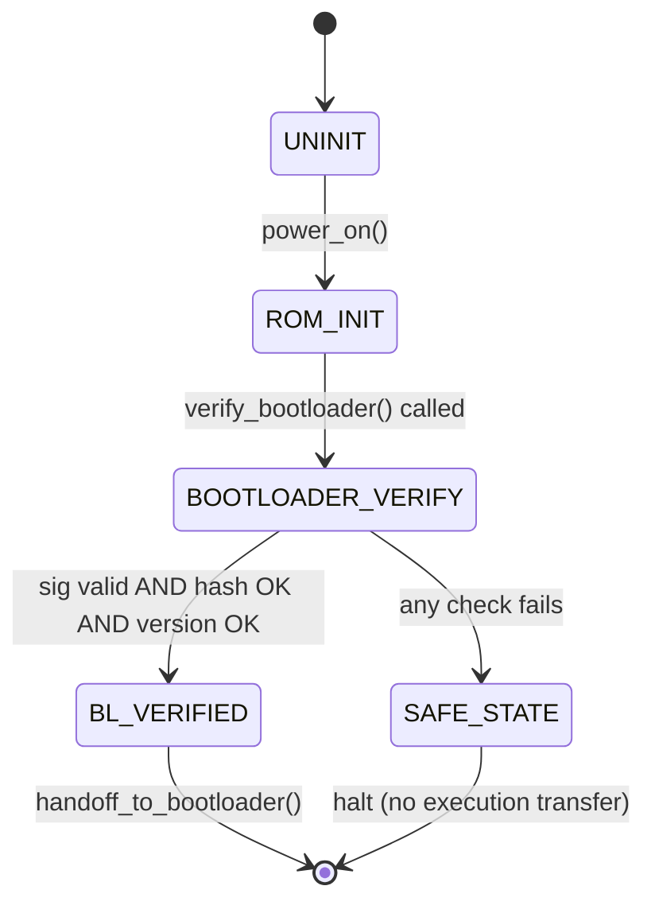

# LLD — BootROM

**Document ID:** SB-LLD-001 | **Version:** 0.1 | **Date:** 2026-06-09 | **ASPICE:** SWE.3

| Version | Date | Author | Change |
|---|---|---|---|
| 0.1 | 2026-06-09 | [Author TBD] | Initial release |

---

## 1. Module Purpose

`boot_rom.py` simulates the immutable hardware root of trust — the first code executed on
power-on. It cannot be modified by software (simulated as a read-only class with no external
write paths). Implements SWR-C-001 (initiate secure boot on startup), SWR-C-002 (verify
bootloader before execution), and SWR-C-008 (verify chain of trust before stage handoff).

---

## 2. Public Interface

```python
class BootROM:
    def power_on(self) -> BootResult
    def verify_bootloader(self, image: bytes, signature: bytes, version: int) -> bool
    def get_status(self) -> dict
```

---

## 3. Internal State Machine



---

## 4. Key Algorithms

1. **`power_on()`**: Reads `NvM(secure_boot_enabled)`; loads OEM public key via `TrustAnchorManager`; transitions `ECUState → ROM_INIT`; calls `verify_bootloader()` with the staged image.
2. **`verify_bootloader()`**: Delegates to `ManifestValidator.validate()` for metadata; calls `CryptoProvider.verify_image_signature()` (ECDSA P-256 via CSM → CryIf → HSM); calls `CryptoProvider.compute_image_hash()` (SHA-256); checks hash against manifest; calls `VersionManager.validate_version(BOOTLOADER, version)`.
3. **Failure path**: On any `False` return or exception, calls `SecurityLogger.log_verification_failure(BOOT_ROM, reason)` and transitions `ECUState → SAFE_STATE`. Never falls through to execution.
4. **Anti-tamper**: `BootROM` holds no key material; all crypto operations go through `HSM` via `CryptoProvider`.

---

## 5. Data Structures

```python
_status: str              # current status string for API reporting
_boot_attempt: int        # incremented on each power_on(); reset on success
_tam: TrustAnchorManager  # injected dependency
_cp: CryptoProvider       # injected dependency
_mv: ManifestValidator    # injected dependency
_vm: VersionManager       # injected dependency
_sl: SecurityLogger       # injected dependency
_ecu: ECUState            # injected shared state
_nvm: NvM                 # injected dependency
```

---

## 6. Error Codes

| Code | Meaning |
|---|---|
| `BootROMError("secure_boot_disabled")` | SWR-C-001 — secure_boot_enabled flag is False |
| `BootROMError("manifest_invalid")` | SWR-C-002, SWR-C-014 — manifest parse or integrity failure |
| `BootROMError("sig_invalid")` | SWR-C-002 — ECDSA signature verification failed |
| `BootROMError("hash_mismatch")` | SWR-C-002 — SHA-256 digest does not match manifest |
| `BootROMError("rollback_detected")` | SWR-C-002 — version below NvM floor |
| `BootROMError("retry_limit_exceeded")` | SWR-C-012 — exceeded MAX_BOOT_RETRY_ATTEMPTS |

---

## 7. Unit Test Mapping

| Test File | VT-ID | Requirement |
|---|---|---|
| `test_vt_01_bootloader_sig_verify.py` | VT-01 | SWR-C-001, SWR-C-002 |
| `test_vt_05_public_key_tampering.py` | VT-05 | SWR-C-001 |
| `test_vt_14_chain_of_trust.py` | VT-14 | SWR-C-002, SWR-C-008 |
| `test_vt_20_e2e_regression.py` | VT-20 | SWR-C-001, SWR-C-008 |
