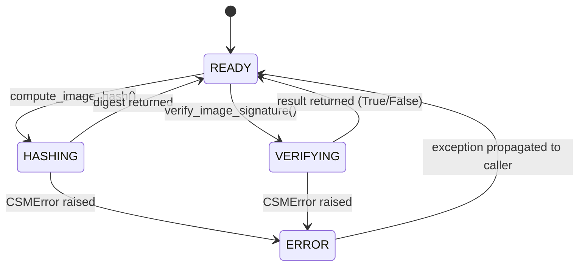

# LLD — CryptoProvider

**Document ID:** SB-LLD-003 | **Version:** 0.1 | **Date:** 2026-06-09 | **ASPICE:** SWE.3

| Version | Date | Author | Change |
|---|---|---|---|
| 0.1 | 2026-06-09 | [Author TBD] | Initial release |

---

## 1. Module Purpose

`crypto_provider.py` is the policy-compliant cryptographic service layer. It enforces the
OEM-approved algorithm selection (SHA-256 + ECDSA P-256 as required by SR-005) and provides
a stable, algorithm-agnostic interface to callers. Wraps `CSM` to dispatch hash and signature
jobs. Implements SWR-C-004 (SHA-256 for image integrity) and SWR-C-005 (ECDSA verification
with OEM public keys).

---

## 2. Public Interface

```python
class CryptoProvider:
    def compute_image_hash(self, image_data: bytes) -> bytes
    def verify_image_signature(self, image_data: bytes, signature: bytes, key_id: str) -> bool
    def get_algorithm_info(self) -> dict
```

---

## 3. Internal State Machine



---

## 4. Key Algorithms

1. **`compute_image_hash(image_data)`**: Calls `CSM.compute_hash(image_data)` which routes to `CryIf.sha256()` → `HSM.sha256()`. Returns 32-byte digest. No fallback to `hashlib` — policy requires HSM path (SR-005).
2. **`verify_image_signature(image_data, signature, key_id)`**: Calls `CSM.verify_signature(image_data, signature, key_id)` → `CryIf.ecdsa_verify()` → `HSM.verify(key_id, data, sig)`. Returns `bool`. Never raises on `False` — only raises if HSM is unavailable.
3. **`get_algorithm_info()`**: Returns `{"hash": APPROVED_HASH_ALGORITHM, "signature": APPROVED_SIGNATURE_ALGORITHM}` from `config.py` — used by VT-17 compliance verification.

---

## 5. Data Structures

```python
_csm: CSM                  # injected; all crypto jobs dispatched via CSM job state machine
_approved_hash: str        # from config.APPROVED_HASH_ALGORITHM
_approved_sig: str         # from config.APPROVED_SIGNATURE_ALGORITHM
```

---

## 6. Error Codes

| Code | Meaning |
|---|---|
| `CryptoProviderError("hsm_unavailable")` | SWR-C-004, SWR-C-005 — HSM simulated failure |
| `CryptoProviderError("csm_job_failed")` | SWR-C-004 — CSM job state machine entered FAILED |
| `CryptoProviderError("unknown_key")` | SWR-C-005 — key_id not registered in HSM |

---

## 7. Unit Test Mapping

| Test File | VT-ID | Requirement |
|---|---|---|
| `test_vt_13_hash_integrity_check.py` | VT-13 | SWR-C-004 |
| `test_vt_17_crypto_algorithm_compliance.py` | VT-17 | SWR-C-004, SWR-C-005 |
