# LLD — DebugManager

**Document ID:** SB-LLD-010 | **Version:** 0.1 | **Date:** 2026-06-09 | **ASPICE:** SWE.3

| Version | Date | Author | Change |
|---|---|---|---|
| 0.1 | 2026-06-09 | [Author TBD] | Initial release |

---

## 1. Module Purpose

`debug_manager.py` enforces production debug interface (JTAG/SWD) access control. In
`PRODUCTION` lifecycle state, debug access is cryptographically gated: a valid ECDSA credential
signed by `HSM_KEY_ID_DEBUG_AUTH` is required. In `DEVELOPMENT`, access is open. Implements
SWR-C-011 (verify debug interface lock status during startup) and SR-009 (secure boot enable
state hardware-protected across resets).

---

## 2. Public Interface

```python
class DebugManager:
    def check_debug_lock_on_startup(self) -> None
    def is_debug_locked(self) -> bool
    def is_secure_boot_enabled(self) -> bool
    def gate_debug_access(self, credential: bytes) -> bool
    def get_status(self) -> dict
```

---

## 3. Internal State Machine

```mermaid
stateDiagram-v2
    [*] --> CHECKING: check_debug_lock_on_startup()
    CHECKING --> LOCKED: lifecycle=PRODUCTION → debug locked
    CHECKING --> OPEN: lifecycle=DEVELOPMENT
    CHECKING --> LOCKED: lifecycle=EOL → permanently locked
    LOCKED --> VERIFYING_CRED: gate_debug_access() called
    VERIFYING_CRED --> GRANTED: credential sig valid
    VERIFYING_CRED --> LOCKED: credential sig invalid → log tamper event
    OPEN --> GRANTED: gate_debug_access() always True in DEVELOPMENT
    GRANTED --> LOCKED: session ends (lock re-asserted on next startup)
```



---

## 4. Key Algorithms

1. **`check_debug_lock_on_startup()`**: SWR-C-011 — reads `ECUState.lifecycle`. If `PRODUCTION` or `EOL`, calls `ECUState.debug_locked = True`. Reads `NvM(secure_boot_enabled)` to verify the flag persists across resets (SR-009). Logs result via `SecurityLogger`.
2. **`is_secure_boot_enabled()`**: Returns `NvM.read(NVM_KEY_SECURE_BOOT_ENABLED, default=True)`. Simulation models the hardware-protected fuse as a NvM flag that cannot be set to `False` by software in `PRODUCTION` (guarded by lifecycle check).
3. **`gate_debug_access(credential)`**: If `lifecycle == DEVELOPMENT`, returns `True` immediately. If `PRODUCTION`, calls `HSM.verify(HSM_KEY_ID_DEBUG_AUTH, challenge, credential)`. Returns `True` only on valid signature. On `False`, logs tamper event via `SecurityLogger.log_tamper_event()`.
4. **`check_disable_attempt()`**: Any software attempt to set `secure_boot_enabled=False` in `PRODUCTION` is rejected and logged as a tamper event — the flag is read-only in that state.

---

## 5. Data Structures

```python
_ecu: ECUState     # lifecycle and debug_locked state
_nvm: NvM          # persistent secure_boot_enabled and debug_locked flags
_hsm: HSM          # debug credential verification
_sl: SecurityLogger
```

---

## 6. Error Codes

| Code | Meaning |
|---|---|
| `DebugManagerError("secure_boot_disable_blocked")` | SR-009 — attempt to disable secure boot in PRODUCTION |
| `DebugManagerError("credential_invalid")` | SWR-C-011 — debug access credential ECDSA verification failed |
| `DebugManagerError("permanently_locked")` | SWR-C-011 — EOL lifecycle; no debug access permitted |

---

## 7. Unit Test Mapping

| Test File | VT-ID | Requirement |
|---|---|---|
| `test_vt_06_secure_boot_enable_fuse.py` | VT-06 | SR-009 |
| `test_vt_09_debug_interface_lock.py` | VT-09 | SWR-C-011 |
