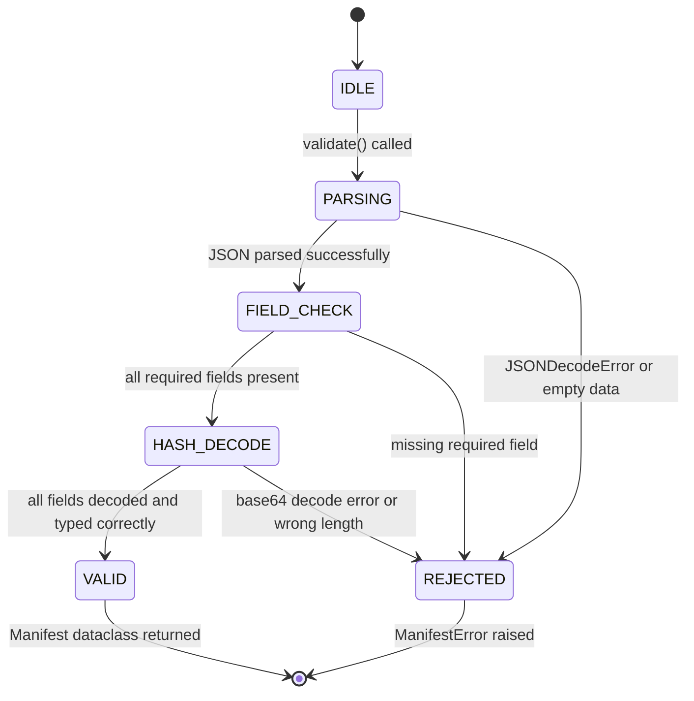

# LLD — ManifestValidator

**Document ID:** SB-LLD-009 | **Version:** 0.1 | **Date:** 2026-06-09 | **ASPICE:** SWE.3

| Version | Date | Author | Change |
|---|---|---|---|
| 0.1 | 2026-06-09 | [Author TBD] | Initial release |

---

## 1. Module Purpose

`manifest_validator.py` parses and validates firmware image manifest metadata before any
signature or hash verification is attempted. If the manifest is malformed or corrupted, boot
halts before any crypto work is done — the manifest is the first gate. Implements SWR-C-014
(reject images with invalid manifests or corrupted metadata).

---

## 2. Public Interface

```python
@dataclass
class Manifest:
    image_hash: bytes        # expected SHA-256 of the firmware image
    signature: bytes         # DER-encoded ECDSA P-256 signature
    version: int             # firmware version for anti-rollback
    component: str           # "BOOTLOADER" or "APPLICATION"
    key_id: str              # HSM key ID to use for signature verification

class ManifestValidator:
    def validate(self, manifest_data: bytes) -> Manifest
    def parse(self, raw: bytes) -> dict
    def check_required_fields(self, parsed: dict) -> bool
```

---

## 3. Internal State Machine



---

## 4. Key Algorithms

1. **`validate(manifest_data)`**: Calls `parse()`, then `check_required_fields()`, then type-validates each field. Returns a `Manifest` dataclass with typed fields. Raises `ManifestError` on any failure — callers must not proceed to crypto verification on error.
2. **`parse(raw)`**: Decodes `manifest_data` as UTF-8 JSON. `image_hash` and `signature` fields are base64-encoded bytes in the JSON payload.
3. **`check_required_fields(parsed)`**: Validates presence of `image_hash`, `signature`, `version`, `component`, `key_id`. Returns `False` if any is missing or `None`.
4. **Robustness**: Catches all `Exception` types during parsing — any unexpected format is a `REJECTED` outcome. No partial manifests are ever accepted.

---

## 5. Data Structures

```python
REQUIRED_FIELDS: frozenset[str] = frozenset(
    {"image_hash", "signature", "version", "component", "key_id"}
)
```

---

## 6. Error Codes

| Code | Meaning |
|---|---|
| `ManifestError("parse_failed")` | SWR-C-014 — JSON decode error or empty manifest |
| `ManifestError("missing_field:<name>")` | SWR-C-014 — required field absent from manifest |
| `ManifestError("decode_failed:<field>")` | SWR-C-014 — base64 decode error for hash or signature |
| `ManifestError("invalid_version")` | SWR-C-014 — version field is not a positive integer |

---

## 7. Unit Test Mapping

| Test File | VT-ID | Requirement |
|---|---|---|
| `test_vt_02_application_sig_integrity.py` | VT-02 | SWR-C-014 |
| `test_vt_04_invalid_manifest.py` | VT-04 | SWR-C-014 |
| `test_vt_13_hash_integrity_check.py` | VT-13 | SWR-C-014 |
| `test_vt_14_chain_of_trust.py` | VT-14 | SWR-C-014 |
