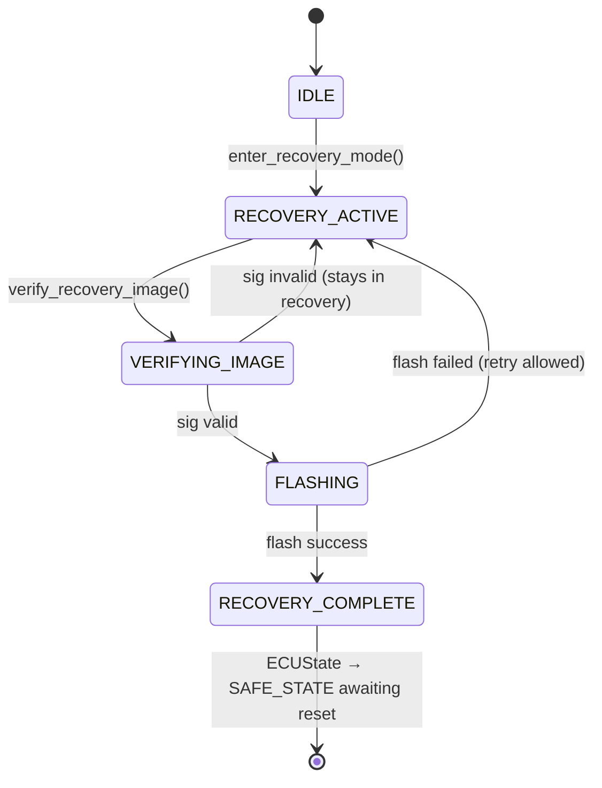

# LLD — RecoveryManager

**Document ID:** SB-LLD-005 | **Version:** 0.1 | **Date:** 2026-06-09 | **ASPICE:** SWE.3

| Version | Date | Author | Change |
|---|---|---|---|
| 0.1 | 2026-06-09 | [Author TBD] | Initial release |

---

## 1. Module Purpose

`recovery_manager.py` provides authenticated recovery mode. When verification fails, the ECU
enters recovery rather than executing unverified code. Only images authenticated with a valid
OEM signature are accepted in recovery mode. Implements SWR-C-009 (initiate authenticated
recovery upon verification failure; reject unsigned recovery images per SR-017).

---

## 2. Public Interface

```python
class RecoveryManager:
    def enter_recovery_mode(self, reason: str) -> None
    def verify_recovery_image(self, image: bytes, signature: bytes) -> bool
    def execute_recovery_flash(self, image: bytes, signature: bytes) -> bool
    def get_recovery_status(self) -> dict
```

---

## 3. Internal State Machine



---

## 4. Key Algorithms

1. **`enter_recovery_mode(reason)`**: Calls `ECUState.transition(SAFE_STATE, reason)`. Logs via `SecurityLogger.log_boot_event(RECOVERY_ENTERED)`. Writes `NvM(recovery_active=True)`. Increments `NvM(boot_failure_count)`.
2. **`verify_recovery_image(image, signature)`**: Uses `CryptoProvider.verify_image_signature()` with `HSM_KEY_ID_OEM_SIGNING`. Unsigned or tampered images return `False` — they are never flashed (SR-017). Logs result via `SecurityLogger`.
3. **`execute_recovery_flash(image, signature)`**: Calls `verify_recovery_image()` first. Only if `True`, writes image to NvM staging area and sets `recovery_complete` flag. On failure, remains in `RECOVERY_ACTIVE` — does not lock out unless retry limit exceeded.

---

## 5. Data Structures

```python
_state: str                 # IDLE / RECOVERY_ACTIVE / VERIFYING_IMAGE / FLASHING / RECOVERY_COMPLETE
_reason: Optional[str]      # failure reason that triggered recovery
_cp: CryptoProvider
_sl: SecurityLogger
_nvm: NvM
_ecu: ECUState
```

---

## 6. Error Codes

| Code | Meaning |
|---|---|
| `RecoveryError("not_in_recovery_mode")` | SWR-C-009 — method called outside recovery state |
| `RecoveryError("recovery_image_sig_invalid")` | SWR-C-009, SR-017 — unsigned/tampered recovery image rejected |
| `RecoveryError("flash_failed")` | SWR-C-009 — NvM write failure during recovery flash |

---

## 7. Unit Test Mapping

| Test File | VT-ID | Requirement |
|---|---|---|
| `test_vt_04_invalid_manifest.py` | VT-04 | SWR-C-009 |
| `test_vt_11_recovery_mode_auth.py` | VT-11 | SWR-C-009 |
