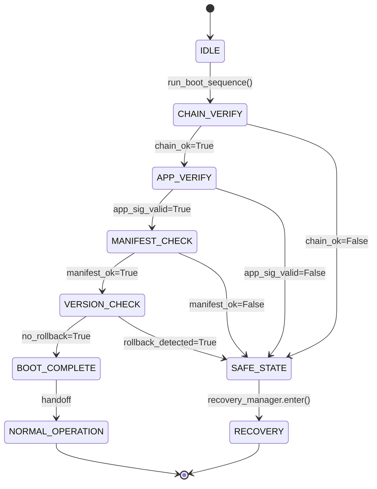

# LLD — SecureBootManager

**Document ID:** SB-LLD-002 | **Version:** 0.1 | **Date:** 2026-06-09 | **ASPICE:** SWE.3

| Version | Date | Author | Change |
|---|---|---|---|
| 0.1 | 2026-06-09 | [Author TBD] | Initial release |

---

## 1. Module Purpose

`secure_boot_manager.py` is the top-level orchestrator for the full secure boot sequence after
BootROM hands off control. It coordinates application image verification, chain-of-trust
validation, interruption detection, and recovery routing. Implements SWR-C-001 (initiate
secure boot), SWR-C-003 (verify application image), SWR-C-008 (verify chain of trust),
SWR-C-012 (restart after abnormal interruption), SWR-C-014 (reject invalid manifests).

---

## 2. Public Interface

```python
class SecureBootManager:
    def run_boot_sequence(self) -> BootResult
    def verify_application_image(self, image: bytes, signature: bytes, version: int) -> bool
    def handle_interruption(self) -> None
    def get_boot_status(self) -> dict
```

---

## 3. Internal State Machine



---

## 4. Key Algorithms

1. **`run_boot_sequence()`**: Checks `NvM(boot_attempt_count)`; if `> 0` calls `handle_interruption()`. Proceeds through `CHAIN_VERIFY → APP_VERIFY → MANIFEST_CHECK → VERSION_CHECK`. On success, calls `AttestationService.measure_component()` before `ECUState.transition(NORMAL_OPERATION)`.
2. **`verify_application_image()`**: Calls `ManifestValidator.validate()` → `CryptoProvider.verify_image_signature()` → `CryptoProvider.compute_image_hash()`. Hash must match manifest; signature must verify against `HSM_KEY_ID_OEM_SIGNING`.
3. **`handle_interruption()`**: SWR-C-012 — reads `boot_attempt_count` from NvM; logs recovery event; increments counter; if `> MAX_BOOT_RETRY_ATTEMPTS` transitions to `LOCKED_OUT`.
4. **Failure path**: Any `False` result → `SecurityLogger.log_verification_failure()` → `RecoveryManager.enter_recovery_mode()`.

---

## 5. Data Structures

```python
_state: str                       # internal state label
_boot_result: Optional[BootResult]
_cp: CryptoProvider
_mv: ManifestValidator
_vm: VersionManager
_rm: RecoveryManager
_sl: SecurityLogger
_att: AttestationService
_ecu: ECUState
_nvm: NvM
```

---

## 6. Error Codes

| Code | Meaning |
|---|---|
| `SecureBootError("chain_broken")` | SWR-C-008 — chain of trust check failed |
| `SecureBootError("app_sig_invalid")` | SWR-C-003 — application ECDSA signature invalid |
| `SecureBootError("app_hash_mismatch")` | SWR-C-003 — application SHA-256 digest mismatch |
| `SecureBootError("manifest_invalid")` | SWR-C-014 — manifest parse or metadata integrity failure |
| `SecureBootError("rollback_detected")` | SWR-C-007 — application version below NvM floor |
| `SecureBootError("retry_limit_exceeded")` | SWR-C-012 — exceeded MAX_BOOT_RETRY_ATTEMPTS |

---

## 7. Unit Test Mapping

| Test File | VT-ID | Requirement |
|---|---|---|
| `test_vt_01_bootloader_sig_verify.py` | VT-01 | SWR-C-001, SWR-C-008 |
| `test_vt_02_application_sig_integrity.py` | VT-02 | SWR-C-003 |
| `test_vt_04_invalid_manifest.py` | VT-04 | SWR-C-014 |
| `test_vt_07_power_loss_recovery.py` | VT-07 | SWR-C-012 |
| `test_vt_13_hash_integrity_check.py` | VT-13 | SWR-C-003, SWR-C-014 |
| `test_vt_14_chain_of_trust.py` | VT-14 | SWR-C-008 |
| `test_vt_20_e2e_regression.py` | VT-20 | SWR-C-001, SWR-C-008 |
