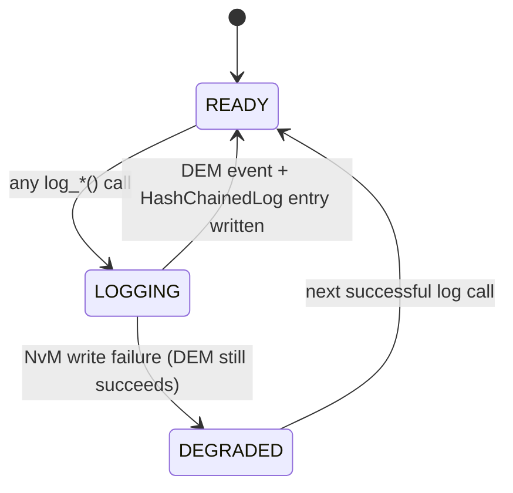

# LLD — SecurityLogger

**Document ID:** SB-LLD-008 | **Version:** 0.1 | **Date:** 2026-06-09 | **ASPICE:** SWE.3

| Version | Date | Author | Change |
|---|---|---|---|
| 0.1 | 2026-06-09 | [Author TBD] | Initial release |

---

## 1. Module Purpose

`security_logger.py` is the single point for recording boot failures, tamper detections, and
security events. It writes to two sinks: `DEM` (AUTOSAR diagnostic event manager, runtime
query-able) and `HashChainedLog` in NvM (tamper-evident, SHA-256 chained, persistent).
No other module is allowed to use `print()` for security events — all go through this module.
Implements SWR-C-010 (record boot failures and security events in protected storage) and
SWR-C-015 (generate tamper event when verification anomalies are detected).

---

## 2. Public Interface

```python
class SecurityLogger:
    def log_boot_event(self, event_type: str, detail: dict | None = None) -> DemEvent
    def log_verification_failure(self, stage: str, reason: str, detail: dict | None = None) -> DemEvent
    def log_tamper_event(self, context: str, detail: dict | None = None) -> DemEvent
    def get_audit_log(self, last_n: int = 50) -> list[dict]
    def verify_log_integrity(self) -> bool
```

---

## 3. Internal State Machine



---

## 4. Key Algorithms

1. **`log_boot_event(event_type, detail)`**: Determines `Severity` from `event_type` (INFO for success events, WARNING for anomalies). Calls `DEM.log()` with `swr_ref=SWR-C-010`. Calls `HashChainedLog.log()` with `detail`.
2. **`log_verification_failure(stage, reason, detail)`**: Always logs at `Severity.CRITICAL`. Calls `DEM.log(CRITICAL, BOOT_FAIL_<stage>, swr_ref=SWR-C-010)`. Writes to HashChainedLog. Writes summary to `NvM(last_security_event)`.
3. **`log_tamper_event(context, detail)`**: SWR-C-015 — called when anomaly detected. Always `Severity.CRITICAL`. Includes `swr_ref=SWR-C-015`. Writes to both DEM and NvM.
4. **`verify_log_integrity()`**: Calls `HashChainedLog.verify_integrity()` — walks SHA-256 chain to detect any post-write modification.

---

## 5. Data Structures

```python
_dem: DEM                      # injected; AUTOSAR DEM for runtime query
_audit_log: HashChainedLog     # tamper-evident append-only journal
_nvm: NvM                      # injected; persists last_security_event summary
```

---

## 6. Error Codes

| Code | Meaning |
|---|---|
| `SecurityLoggerError("nvm_write_failed")` | SWR-C-010 — NvM persistence failed (DEM entry still created) |
| `SecurityLoggerError("integrity_violated")` | SWR-C-010 — HashChainedLog chain broken |

---

## 7. Unit Test Mapping

| Test File | VT-ID | Requirement |
|---|---|---|
| `test_vt_04_invalid_manifest.py` | VT-04 | SWR-C-010 |
| `test_vt_08_tamper_glitch_response.py` | VT-08 | SWR-C-010, SWR-C-015 |
| `test_vt_15_boot_log_protection.py` | VT-15 | SWR-C-010, SWR-C-015 |
