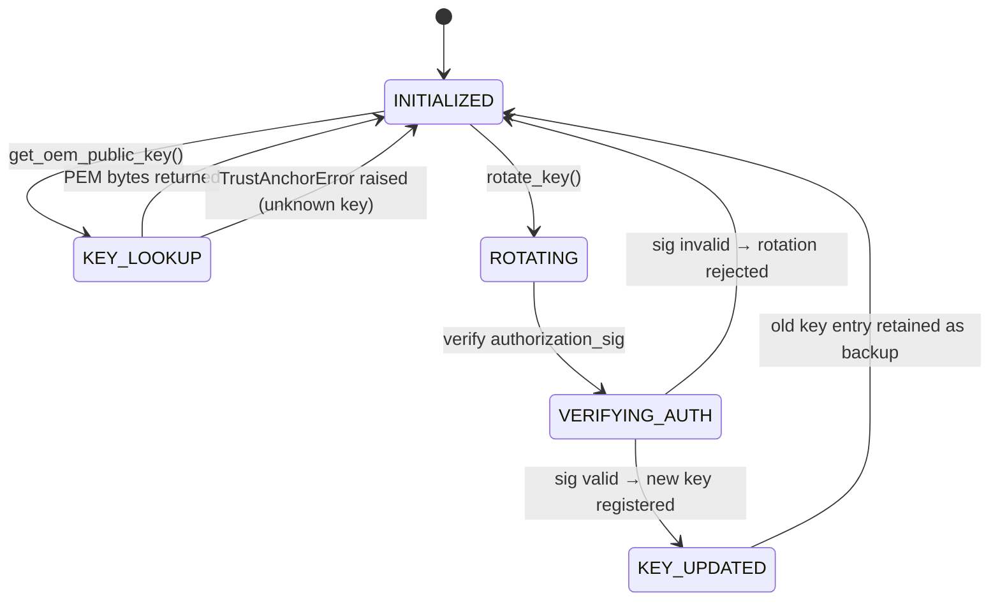

# LLD — TrustAnchorManager

**Document ID:** SB-LLD-007 | **Version:** 0.1 | **Date:** 2026-06-09 | **ASPICE:** SWE.3

| Version | Date | Author | Change |
|---|---|---|---|
| 0.1 | 2026-06-09 | [Author TBD] | Initial release |

---

## 1. Module Purpose

`trust_anchor_manager.py` manages the OEM root-of-trust key registry. It protects OEM
verification keys from unauthorized modification, exposes only public key PEM to callers, and
supports authorized key rotation without hardware replacement. Private key bytes are always
confined to `hsm.py`. Implements SR-002 (protect trust anchor; support key rotation),
SR-011 (private keys never present on ECU — HSM boundary enforcement), and SR-020
(algorithm migration and key rotation without hardware replacement). Also satisfies SWR-C-005
(ECDSA verification using provisioned OEM public keys).

---

## 2. Public Interface

```python
class TrustAnchorManager:
    def get_oem_public_key(self, key_id: str) -> bytes
    def rotate_key(self, new_key_id: str, authorization_sig: bytes) -> bool
    def is_key_registered(self, key_id: str) -> bool
    def get_registered_key_ids(self) -> list[str]
```

---

## 3. Internal State Machine



---

## 4. Key Algorithms

1. **`get_oem_public_key(key_id)`**: Calls `HSM.get_public_key_pem(key_id)`. Returns PEM bytes only — never raw private key material. Raises `TrustAnchorError("unknown_key")` if `key_id` not in HSM.
2. **`rotate_key(new_key_id, authorization_sig)`**: Requires authorization signed by the current root key (`HSM_KEY_ID_OEM_ROOT`). Calls `HSM.verify(HSM_KEY_ID_OEM_ROOT, new_key_id.encode(), authorization_sig)`. Only if valid, calls `HSM.generate_key_pair(new_key_id)` and registers the new key_id. Logs rotation event via `SecurityLogger`.
3. **`is_key_registered(key_id)`**: Tries `HSM.get_public_key_pem(key_id)` and returns `True` on success, `False` on `HSMError`.

---

## 5. Data Structures

```python
_hsm: HSM                           # injected; all key operations go through HSM
_sl: SecurityLogger                 # injected; logs rotation and access events
_registered_keys: list[str]         # logical registry of known key IDs
```

---

## 6. Error Codes

| Code | Meaning |
|---|---|
| `TrustAnchorError("unknown_key")` | SR-002 — key_id not registered in HSM |
| `TrustAnchorError("rotation_auth_failed")` | SR-002 — authorization signature for rotation is invalid |
| `TrustAnchorError("hsm_unavailable")` | SR-011 — HSM simulated failure |

---

## 7. Unit Test Mapping

| Test File | VT-ID | Requirement |
|---|---|---|
| `test_vt_05_public_key_tampering.py` | VT-05 | SR-002 |
| `test_vt_10_hsm_key_nonexportability.py` | VT-10 | SR-011 |
| `test_vt_16_key_provisioning_audit.py` | VT-16 | SR-011 |
| `test_vt_21_cert_chain_validation.py` | VT-21 | SR-002, SR-020 |
| `test_vt_22_cert_expiration.py` | VT-22 | SR-002, SR-020 |
