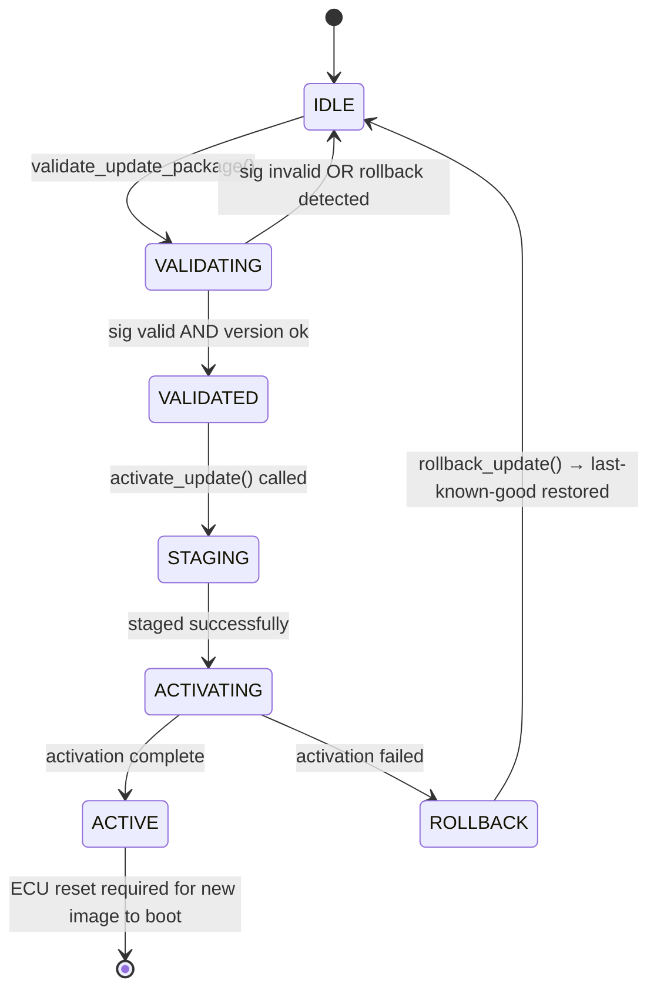

# LLD — UpdateManager

**Document ID:** SB-LLD-006 | **Version:** 0.1 | **Date:** 2026-06-09 | **ASPICE:** SWE.3

| Version | Date | Author | Change |
|---|---|---|---|
| 0.1 | 2026-06-09 | [Author TBD] | Initial release |

---

## 1. Module Purpose

`update_manager.py` handles OTA and service update package authentication and atomic activation.
It verifies the update package signature before any write, enforces anti-rollback, and provides
fallback to the last known-good image on activation failure. Implements SWR-C-013 (verify update
package authenticity before activation) and SR-010 (atomic activation with fallback).

---

## 2. Public Interface

```python
class UpdateManager:
    def validate_update_package(self, package: bytes, signature: bytes) -> bool
    def activate_update(self, package: bytes, signature: bytes) -> bool
    def rollback_update(self) -> bool
    def get_update_status(self) -> dict
```

---

## 3. Internal State Machine



---

## 4. Key Algorithms

1. **`validate_update_package(package, signature)`**: Calls `CryptoProvider.verify_image_signature()`. Then `VersionManager.validate_version(APPLICATION, package_version)` to confirm no rollback. Returns `False` (does not raise) if either check fails; logs via `SecurityLogger`.
2. **`activate_update(package, signature)`**: Calls `validate_update_package()` as a guard. Sets `NvM(update_pending=True)`. Writes staged image to NvM. Calls `VersionManager.commit_version()` to ratchet counter. Clears `update_pending`. On any write failure, calls `rollback_update()` atomically.
3. **`rollback_update()`**: Restores the previous NvM image entry. Decrements the version counter back to the previous floor. Logs `UPDATE_ROLLBACK` via `SecurityLogger`.

---

## 5. Data Structures

```python
_state: str                      # IDLE / VALIDATING / STAGING / ACTIVATING / ROLLBACK
_pending_package: Optional[bytes]
_previous_version: Optional[int] # saved before commit for rollback
_cp: CryptoProvider
_vm: VersionManager
_sl: SecurityLogger
_nvm: NvM
```

---

## 6. Error Codes

| Code | Meaning |
|---|---|
| `UpdateError("sig_invalid")` | SWR-C-013 — update package ECDSA verification failed |
| `UpdateError("rollback_detected")` | SWR-C-013 — package version below NvM floor |
| `UpdateError("staging_failed")` | SWR-C-013 — NvM write failure during staging |
| `UpdateError("activation_failed")` | SR-010 — activation error; rollback triggered |

---

## 7. Unit Test Mapping

| Test File | VT-ID | Requirement |
|---|---|---|
| `test_vt_07_power_loss_recovery.py` | VT-07 | SWR-C-013, SR-010 |
| `test_vt_20_e2e_regression.py` | VT-20 | SWR-C-013 |
