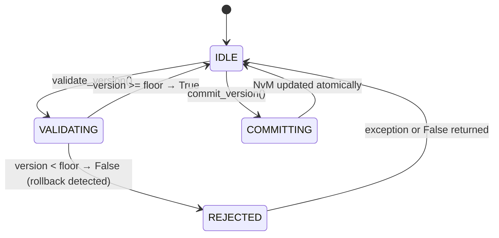

# LLD — VersionManager

**Document ID:** SB-LLD-004 | **Version:** 0.1 | **Date:** 2026-06-09 | **ASPICE:** SWE.3

| Version | Date | Author | Change |
|---|---|---|---|
| 0.1 | 2026-06-09 | [Author TBD] | Initial release |

---

## 1. Module Purpose

`version_manager.py` enforces anti-rollback and replay protection using NvM-backed monotonic
counters. Before any image is accepted, its version is validated against the stored floor.
Implements SWR-C-006 (validate firmware version counters) and SWR-C-007 (reject images below
stored counter). Also satisfies SR-012 (replay protection via freshness counter).

---

## 2. Public Interface

```python
class VersionManager:
    def validate_version(self, component: str, version: int) -> bool
    def commit_version(self, component: str, version: int) -> None
    def get_version(self, component: str) -> int
    def is_rollback(self, component: str, version: int) -> bool
```

---

## 3. Internal State Machine



---

## 4. Key Algorithms

1. **`validate_version(component, version)`**: Reads `NvM.get_counter(rollback_counter_<component>)`. Returns `True` if `version >= floor`. Returns `False` (SWR-C-007) if `version < floor`. Raises on NvM failure.
2. **`commit_version(component, version)`**: Called only after a successful image activation. Writes `NvM.write(rollback_counter_<component>, version)`. This is a one-way ratchet — the value only ever increases. Never called unless `validate_version` returned `True`.
3. **`is_rollback(component, version)`**: Returns `True` if `version < get_version(component)`. Convenience predicate used by UpdateManager.
4. **NvM key mapping**: `BOOTLOADER → config.NVM_KEY_ROLLBACK_COUNTER_BL`, `APPLICATION → config.NVM_KEY_ROLLBACK_COUNTER_APP`.

---

## 5. Data Structures

```python
_nvm: NvM                     # injected; all version state persisted here
_sl: SecurityLogger           # injected; logs rollback events
_component_keys: dict[str, str]  # maps component name → NvM key
```

---

## 6. Error Codes

| Code | Meaning |
|---|---|
| `VersionError("rollback_detected")` | SWR-C-007 — image version below stored counter |
| `VersionError("unknown_component")` | SWR-C-006 — component name not in registry |
| `VersionError("nvm_failure")` | SWR-C-006 — NvM read/write error |

---

## 7. Unit Test Mapping

| Test File | VT-ID | Requirement |
|---|---|---|
| `test_vt_03_rollback_protection.py` | VT-03 | SWR-C-006, SWR-C-007 |
| `test_vt_12_replay_attack.py` | VT-12 | SWR-C-006, SWR-C-007 |
